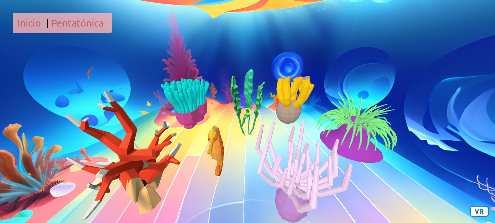

<h1>Coral Musical VR Experience con A-Frame </h1>

Este proyecto pedagógico proporciona una experiencia de realidad virtual (VR) inmersiva utilizando A-Frame para crear una escena 3D submarina. 
La escena incluye varios tipos de corales, algas y un caballito de mar, cada uno representando un instrumento musical diferente. La música original fue compuesta en Musescore y utiliza escala pentatónica en todas sus melodías.
La cámara está fija pero permite rotación para explorar el entorno.

<h1>Instrucciones de uso</h1>

Abre el enlace https://coral-musical.vercel.app/ en tu navegador web.
Haz click en "pentatónica" para aprender más sobre esta escala.
Usa el ratón para girar la cámara y explorar la escena submarina.
Haz clic en los distintos elementos de la escena para reproducir los sonidos asociados.
Cada elemento representa un instrumento diferente y tiene una melodía pentatónica.
Pueden sonar por separado o al mismo tiempo. 

